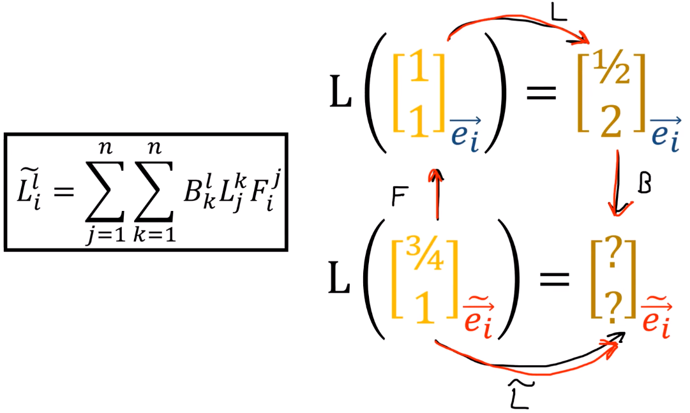

10、线性映射变换规则
===================================

新基下的变换矩阵 :math:`\widetilde{L}` 
--------------------------------------------------------

.. math::

    F \to L \to B

同时使用前向和后向变换来转换矩阵分量

.. _Einstein's_Summation_Agreement:

爱因斯坦求和约定
------------------------------------

定义
^^^^^^^^^^^^^^^^^^^^^^^^^^^^^^^^^^^^

.. important::

   当同一项中出现 **重复指标** （一个上标，一个下标）时，自动对该指标求和。

   省略求和符号 :math:`\sum`，简化书写。

基本规则
^^^^^^^^^^^^^^^^^^^^^^^^^^^^^^^^^^^^

.. list-table:: 求和约定规则
   :header-rows: 1
   :align: center

   * - 规则
     - 说明
     - 示例
   * - 哑指标（求和指标）
     - 成对出现，一上一下
     - :math:`a_i b^i = \sum_i a_i b^i`
   * - 自由指标
     - 只出现一次，保留在结果中
     - :math:`c^i = a_{ij} b^j` 中 :math:`i` 是自由指标
   * - 同一项中不能重复
     - 上标或下标不能单独重复
     - :math:`a_i b_i` ❌ 错误

常见应用
^^^^^^^^^^^^^^^^^^^^^^^^^^^^^^^^^^^^

矩阵乘法

.. math::

   c^i_j = a^i_k b^k_j \quad \Leftrightarrow \quad C = AB

内积

.. math::

   \vec{u} \cdot \vec{v} = u_i v^i

外积

.. math::

   (A \otimes B)^{ij} = a^i b^j

缩并（迹）

.. math::

   \text{tr}(A) = A^i_i

注意事项
^^^^^^^^^^^^^^^^^^^^^^^^^^^^^^^^^^^^

.. warning::

   1. **指标位置很重要**：上标和下标不能随意交换
   2. **哑指标可改名**： :math:`a_i b^i = a_j b^j` （求和指标是"哑"的）
   3. **自由指标必须匹配**：等式两边自由指标必须相同

   .. math::

      c^i = a^i_j b^j \quad \checkmark

   .. math::

      c^i = a_j b^j \quad \times \text{（左边有 } i \text{，右边没有）}

.. _Kronecker_symbol:

克罗内克符号(Levi-Civita symbol)
------------------------------------

定义
^^^^^^^^^^^^^^^^^^^^^^^^^^^^^^^^^^^^

.. important::

   克罗内克符号 :math:`\delta_{ij}` 是一个二元函数，定义如下：

   .. math::

      \delta_{ij} = \begin{cases} 1 & \text{if } i = j \\ 0 & \text{if } i \neq j \end{cases}

矩阵表示
^^^^^^^^^^^^^^^^^^^^^^^^^^^^^^^^^^^^

.. math::

   [\delta_{ij}] = I_n = \begin{bmatrix} 1 & 0 & \cdots & 0 \\ 0 & 1 & \cdots & 0 \\ \vdots & \vdots & \ddots & \vdots \\ 0 & 0 & \cdots & 1 \end{bmatrix}

基本性质
^^^^^^^^^^^^^^^^^^^^^^^^^^^^^^^^^^^^

.. list-table:: 克罗内克符号的性质
   :header-rows: 1
   :align: center

   * - 性质
     - 公式
     - 说明
   * - 筛选性
     - :math:`\delta_{ij} a_j = a_i`
     - 保留 :math:`j=i` 的项
   * - 对称性
     - :math:`\delta_{ij} = \delta_{ji}`
     - 交换指标不变
   * - 迹
     - :math:`\delta_{ii} = n`
     - :math:`n` 维空间中（爱因斯坦求和）
   * - 自乘
     - :math:`\delta_{ij}\delta_{jk} = \delta_{ik}`
     - 指标缩并

张量中的应用
^^^^^^^^^^^^^^^^^^^^^^^^^^^^^^^^^^^^

对偶基定义条件

.. math::

   \epsilon^i(\vec{e}_j) = \delta_{ij}

基变换的互逆性

.. math::

   \sum_j B_{ij} F_{jk} = \delta_{ik} \quad \text{或} \quad BF = I

指标替换

.. math::

    g^{ik} g_{kj} = \delta_{ij}

广义克罗内克符号
^^^^^^^^^^^^^^^^^^^^^^^^^^^^^^^^^^^^

.. important::

   混合指标形式 :math:`\delta^i_j` 同样满足：

   .. math::

      \delta^i_j = \begin{cases} 1 & i = j \\ 0 & i \neq j \end{cases}

   用于指标升降：

   .. math::

      v^i = \delta^i_j v^j

线性映射分量变换的推导
------------------------------------

由 :math:`\textcolor{red}{B^z_y} \textcolor{#3949AB}{F^x_z} = \delta^x_y` 得：

.. math::

   \widetilde{L}^l_i = {B}^l_k L^k_j {F}^j_i

.. math::

   \textcolor{red}{F^s_l} \widetilde{L}^l_i \textcolor{#3949AB}{B^i_t} = \textcolor{red}{F^s_l} {B}^l_k L^k_j {F}^j_i \textcolor{#3949AB}{B^i_t}

.. math::

   \textcolor{red}{F^s_l} \widetilde{L}^l_i \textcolor{#3949AB}{B^i_t} = \textcolor{red}{\delta^s_k} L^k_j \textcolor{#3949AB}{\delta^j_t}

.. math::

   \textcolor{red}{F^s_l} \widetilde{L}^l_i \textcolor{#3949AB}{B^i_t} = L^s_t

