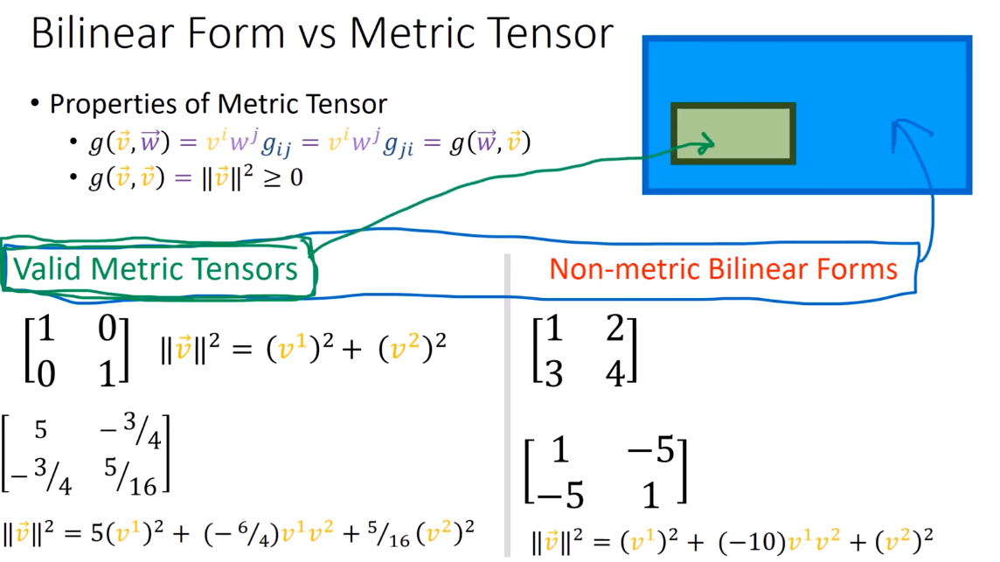

12、双线性形式
===================================

- 度规张量是一个函数 :math:`g: V \times V \rightarrow \mathbb{R}`

- 度规张量性质

  - :math:`g: V \times V \rightarrow \mathbb{R}`

  - :math:`a g(\vec{v}, \vec{w}) = g(a\vec{v}, \vec{w}) = g(\vec{v}, a\vec{w})`

  - :math:`g(\vec{v} + \vec{u}, \vec{w}) = g(\vec{v}, \vec{w}) + g(\vec{u}, \vec{w})`

  - :math:`g(\vec{v}, \vec{w} + \vec{t}) = g(\vec{v}, \vec{w}) + g(\vec{v}, \vec{t})`

其中：   :math:`g(\vec{v}, \vec{w}) \mapsto v^i w^j g_{ij}`

.. note::

   | 度规张量的分量关于对角线对称，因此度规张量是特殊的双线性张量
   | 满足：

    - :math:`g(\vec{v}, \vec{w}) = v^i w^j g_{ij} = v^i w^j g_{ji} = g(\vec{w}, \vec{v})`

    - :math:`g(\vec{v}, \vec{v}) = \|\vec{v}\|^2 \geq 0`

双线性形式定义
------------------------------------

- :math:`\mathcal{B}: V \times V \rightarrow \mathbb{R}`

- :math:`a\mathcal{B}(\vec{v}, \vec{w}) = \mathcal{B}(a\vec{v}, \vec{w}) = \mathcal{B}(\vec{v}, a\vec{w})`

- :math:`\mathcal{B}(\vec{v} + \vec{u}, \vec{w}) = \mathcal{B}(\vec{v}, \vec{w}) + \mathcal{B}(\vec{u}, \vec{w})`

- :math:`\mathcal{B}(\vec{v}, \vec{w} + \vec{t}) = \mathcal{B}(\vec{v}, \vec{w}) + \mathcal{B}(\vec{v}, \vec{t})`

其中：   :math:`\mathcal{B}(\vec{v}, \vec{w}) \mapsto v^i w^j \mathcal{B}_{ij}`

如图

\

