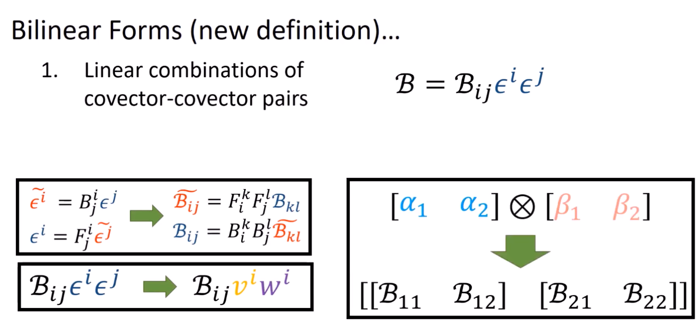

14、双线性形式是余向量-余向量对
===================================

.. math::

   L = L^i_j \underbrace{\vec{e}_i \epsilon^j}_{\text{tensor product}} = L^i_j (\vec{e}_i \otimes \epsilon^j)

双线性形式是余向量-余向量对

.. math::

   \mathcal{B} = \mathcal{B}_{ij} \epsilon^i \epsilon^j = \mathcal{B}_{ij} (\epsilon^i \otimes \epsilon^j)

总结

\
