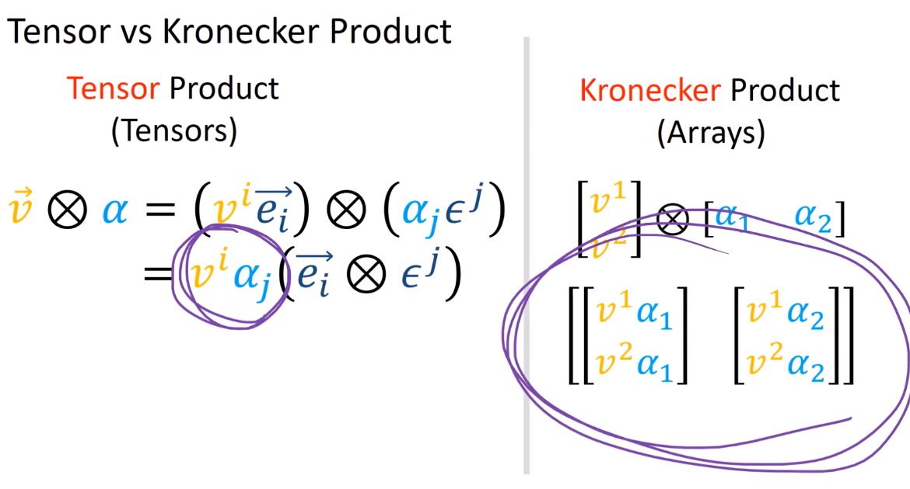

15、张量积与克罗内克积
===================================

 :math:`\otimes` 是一个重要的数学运算符，既可以作用于张量，也可以作用于数组/矩阵。根据作用对象的不同，:math:`\otimes` 有两种不同的含义：

.. grid:: 2

   .. grid-item-card:: 张量积（Tensor Product）
      :class-header: bg-danger text-white

      作用对象：张量

      .. math::

         \textcolor{#3949AB}{\vec{e}_i} \otimes \textcolor{#3949AB}{\epsilon^j}

      将两个张量组合成一个新的第三张量

   .. grid-item-card:: 克罗内克积（Kronecker Product）
      :class-header: bg-warning text-white

      作用对象：数组/矩阵

      .. math::

         \begin{bmatrix} \textcolor{orange}{v^1} \\ \textcolor{orange}{v^2} \end{bmatrix} \otimes \begin{bmatrix} \textcolor{#3949AB}{\alpha_1} & \textcolor{#3949AB}{\alpha_2} \end{bmatrix}

      将两个数组组合成一个新的第三数组

本质上是相同的操作，只是在不同语境下执行相同的操作

\

