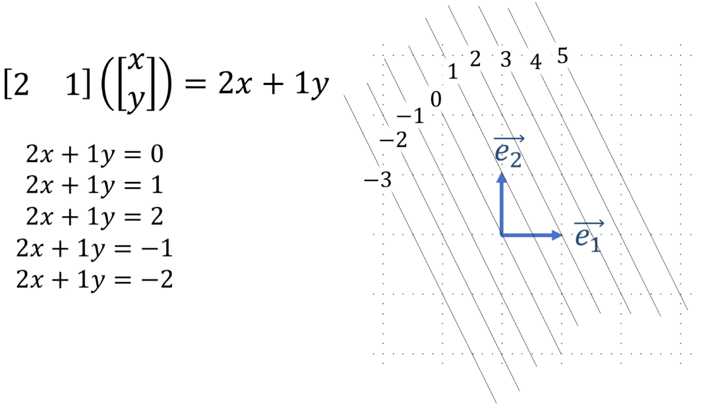
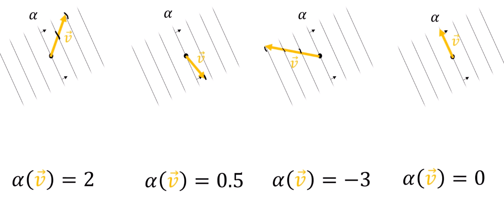
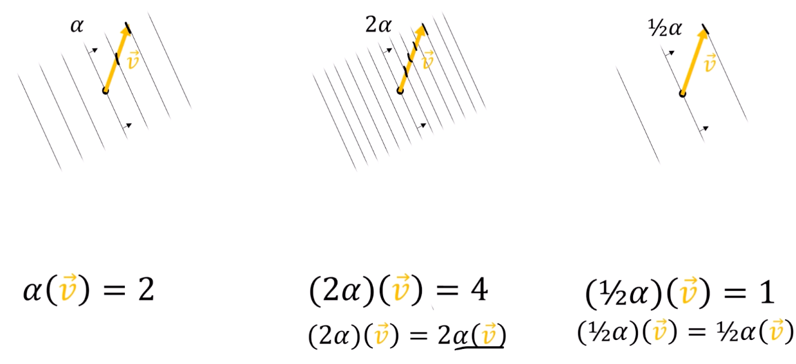
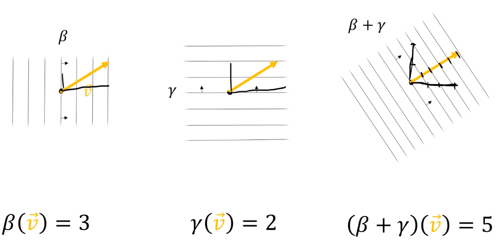
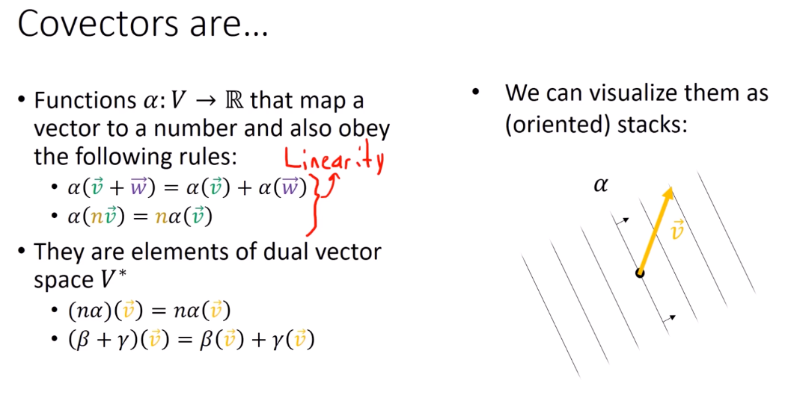

6、什么是余向量(对偶向量)
===================================

::

    向量的分量变换方式与基向量相反，所以称向量为“逆变”的。
    接下来讲解余向量，也就是对偶向量(Covector)。

可以将对偶向量理解为类似于行向量的概念，把行向量看作作用于列向量上的函数。

.. math::

   \begin{bmatrix} 2 & 1 \end{bmatrix} \left( \begin{bmatrix} 3 \\ -4 \end{bmatrix} \right)

用 :math:`\alpha` 来表示对偶向量，得：

.. math::
    :nowrap:

    \begin{gather*}
    \alpha(\vec{v}) = \alpha_1 v^1 + \alpha_2 v^2 + \cdots + \alpha_n v^n = \sum_{i=0}^{n} \alpha_i v^i \\
    \alpha: V \rightarrow \mathbb{R}
    \end{gather*}

对偶向量也就是将向量空间 :math:`V` 映射到实数空间 :math:`\mathbb{R}` 的运算
具有类似函数的性质：

.. math::
    :nowrap:

    \begin{gather*}
    \alpha(\textcolor{#228B22}{\vec{v}} + \textcolor{purple}{\vec{w}}) = \alpha(\textcolor{#228B22}{\vec{v}}) + \alpha(\textcolor{purple}{\vec{w}}) \\
    \alpha(\textcolor{brown}{n}\textcolor{#228B22}{\vec{v}}) = \textcolor{brown}{n}\alpha(\textcolor{#228B22}{\vec{v}})
    \end{gather*}

总结得：

.. math::

   \alpha(\textcolor{brown}{n}\textcolor{#228B22}{\vec{v}} + \textcolor{orange}{m}\textcolor{purple}{\vec{w}}) = \textcolor{brown}{n}\alpha(\textcolor{#228B22}{\vec{v}}) + \textcolor{orange}{m}\alpha(\textcolor{purple}{\vec{w}})

对偶向量可视化(一系列平行等值线)：

对偶向量的值大小为穿过等值线的大小

对偶向量的缩放：

| 对偶向量的加法：
| 相加后，:math:`\beta` 和 :math:`\gamma` 方向的密度跟原来相同

| 总结：

