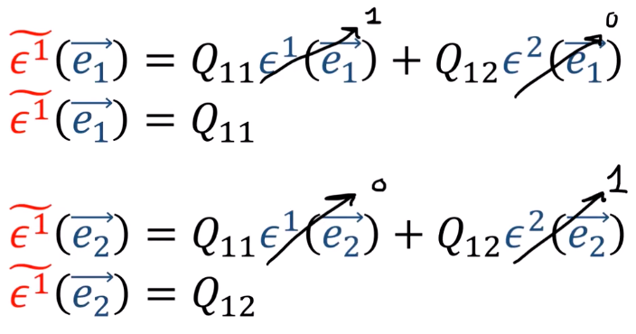

8、余向量变换规则
===================================

余向量旧基变换为新基

旧基为 :math:`\epsilon^1` 和 :math:`\epsilon^2`，新基为 :math:`\widetilde{\epsilon^1}` 和 :math:`\widetilde{\epsilon^2}`，

.. math::

   \widetilde{\epsilon^1} = Q_{11}\epsilon^1 + Q_{12}\epsilon^2

   \widetilde{\epsilon^2} = Q_{21}\epsilon^1 + Q_{22}\epsilon^2

代入得

.. math::

    \widetilde{\epsilon^1}(\overrightarrow{e_1}) = 
    Q_{11}\epsilon^1(\overrightarrow{e_1}) + 
    Q_{12}\epsilon^2(\overrightarrow{e_1})

其中 :math:`\epsilon^1(\overrightarrow{e_1})=1`， :math:`\epsilon^2(\overrightarrow{e_2})=0`
所以得: :math:`\widetilde{\epsilon^1}(\overrightarrow{e_1})=Q_{1}`

