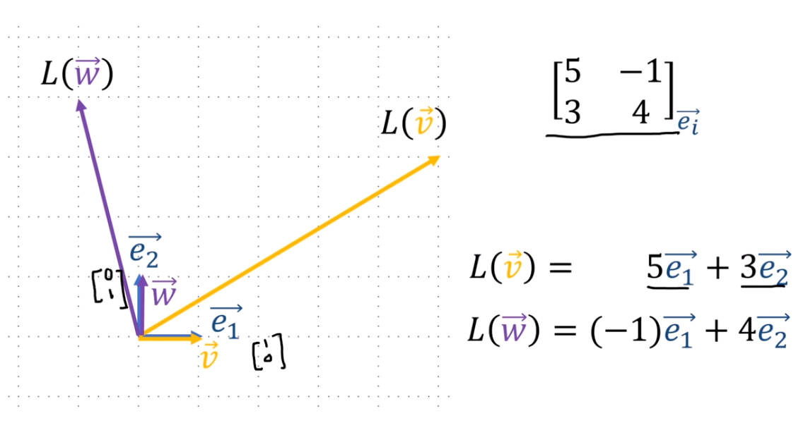
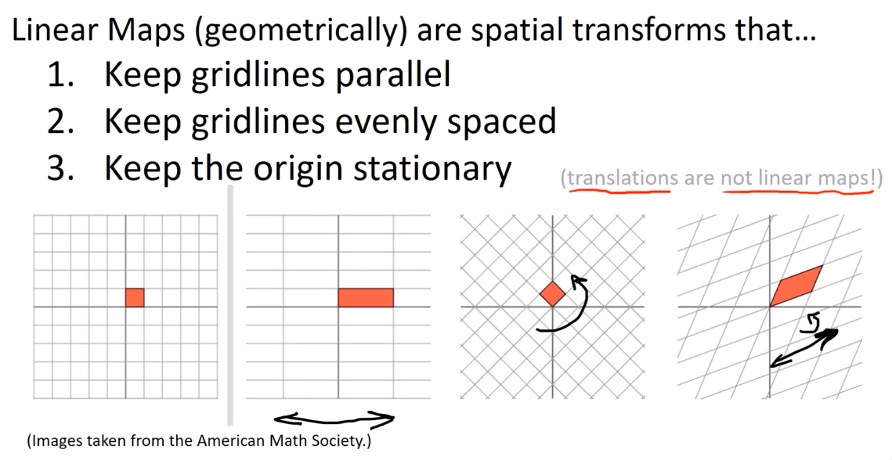

9、线性映射
===================================

::

    线性映射是一种变换，以向量作为输入，并生成一个新的向量作为输出。

线性映射变换的是向量，但线性映射并不变换基

坐标定义
-----------------------------------

线性映射（几何上）是空间变换，满足以下条件：

1. 保持网格线平行
2. 保持网格线等距分布
3. 保持原点固定不动

几何定义
-----------------------------------

.. note::

   平移不属于线性映射

代数抽象定义
-----------------------------------

线性映射
========

抽象定义
--------

.. important::

   线性映射 :math:`L` 满足以下三条：

   1. **映射向量到向量**

      .. math::

         L: V \rightarrow W

   2. **加法保持性**

      先加后映射 = 先映射后加

      .. math::

         L(\vec{v} + \vec{w}) = L(\vec{v}) + L(\vec{w})

   3. **数乘保持性**

      先缩放后映射 = 先映射后缩放

      .. math::

         L(n\vec{v}) = nL(\vec{v})

等价表述
--------

.. note::

   2 和 3 可以合并为一条 **线性组合保持性**：

   .. math::

      L(a\vec{v} + b\vec{w}) = aL(\vec{v}) + bL(\vec{w})

   其中 :math:`a, b` 是标量，:math:`\vec{v}, \vec{w}` 是向量。

几何与代数的对应
----------------

.. list-table::
   :header-rows: 1
   :align: center

   * - 几何特征
     - 代数表达
   * - 保持网格线平行
     - :math:`L(\vec{v} + \vec{w}) = L(\vec{v}) + L(\vec{w})`
   * - 保持网格线等距
     - :math:`L(n\vec{v}) = nL(\vec{v})`
   * - 原点不动
     - :math:`L(\vec{0}) = \vec{0}`